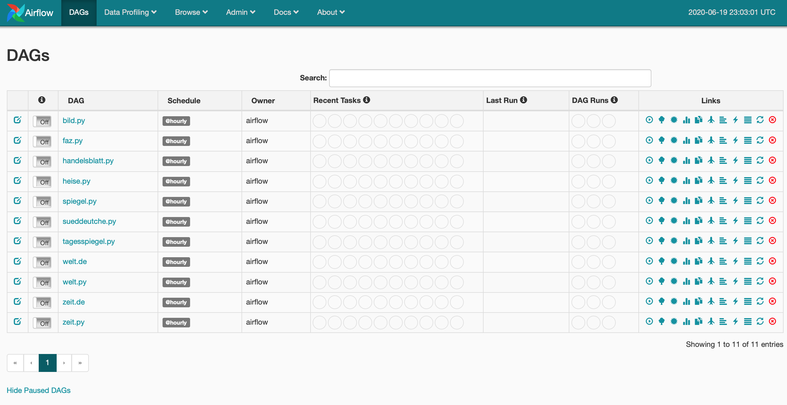

# Airflow NewsCrawler
AirflowNewsCrawler is a software application for crawling online newspaper articles. It is based on [Airflow](https://airflow.readthedocs.io/en/stable/) and [TensorFlow Extended](https://www.tensorflow.org/tfx). The implementation dockerized, thus the user does not need to worry about dependencies. Additionally, `docker-compose` is available to increase the useability for the user. **To start this application run:**
```
docker-compose up
```
The application should be available on `localhost:8080`. You will see the airflow dashboard with our default examples:




